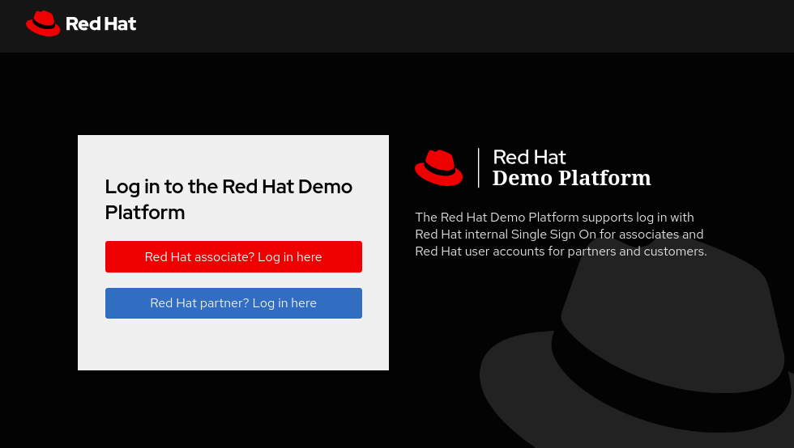

# How to enable and configure a GitLab Runner on the Red Hat TAP Demo environment

This repo describes the remaining steps necessary to configure a GitLab Runner for demo purposes. 

[Red Hat Trusted Application Pipeline](https://catalog.demo.redhat.com/catalog?item=babylon-catalog-prod/enterprise.redhat-tap-demo.prod&utm_source=webapp&utm_medium=share-link) on the [Red Hat Demo Platform](https://catalog.demo.redhat.com/)

GitLab (Community Edition) is already installed as the base git system for the demo, so the high level steps are

1) Create a new GitLab Repo (Project), create a Project Runner and get the Authentication Token from GitLab for that Runner

2) On OpenShift, create a new namespace for the runner, create a ServiceAccount, configMap and Secret - then deploy the Runner CR (since the Runner Operator is already installed).

All the yaml files needed are in the [environment](./environment/) directory and a step-by-step guide is [here](./docs/deploy-runner.md)

