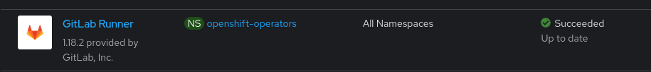

# Deploying a new GitLab Runner Instance

The GitLab Runner Operator has already been installed as part of the TAP Demo environment 



Here it is being used for building the RHDH Techdocs:


So, all we need to do is create another instance - preferably in a separate Namespace (the TechDocs Runner is in the `gitlab` namespace).

`oc new-project cicd-tools`

The GitLab Runner CR is very straightforward and looks like [this](../environment/gitlab-runner.yml):

```
apiVersion: apps.gitlab.com/v1beta2
kind: Runner
metadata:
  name: gitlab-runner
spec:
  gitlabUrl: https://gitlab-gitlab.apps.cluster-9hb28.9hb28.sandbox760.opentlc.com
  buildImage: registry.access.redhat.com/ubi9:latest
  token: gitlab-runner-secret
  config: custom-config-toml
```

`gitlabUrl` - obviously, the URL of the GitLab instance. In the TAP demo environment, you can also get this from the "Demo Access Details" page:


`buildImage` - the default image for the Runner tasks, unless otherwise specified in the pipeline tasks

`token` - a k8s secret containing the Runner token that needs to be obtained from the GitLab instance, linking the GitLab repository and the Runner.

`config` - a k8s configMap containing specific configuration. 

*__NOTE__*: For a simple demo, the `config` will not be needed, default should be fine. However, if you need to run tasks (or images in the tasks) that require higher privileges, we will need to configure allowable service accounts.

```
[[runners]]
  [runners.kubernetes]
      service_account_overwrite_allowed = "buildah-*"
```

We are creating a `buildah-sa` service account with the `anyuid` SCC. With this config, we can assign any `buildah-*` SA to a task in our pipeline definition.

# Getting the GitLab Token

Create a new project in GitLab or import a sample from https://github.com/tap-demo/gitlab-runner-simple 


In your new project (or imported project), go to __Settings -> CI/CD__


Next, expand the __Runners__ section - you can disable the instance runners (that are available to all projects in this GitLab instance) and create a __Project Runner__


For simplicity, don't enter tags but rather select "run untagged jobs" - so it will run all jobs in your pipeline. Then give it a name and save the changes.


On the last page, __copy the authentication token__ 


We will need this token - add this token to the `gitlab-runner-secret.yml` [here](../environment/gitlab-runner-secret.yml) 

You can now navigate back to the runners page, as we don't need any of the installation instructions from this page.


Once we deploy the runner on OpenShift, it will communicate with the GitLab instance and the warning (exclamation mark) will disappear.

# Putting it all together

__1) Create the cicd-tool project or go to it if already created (or any other project, but check the k8s manifests that use the namespace)__

```
[🎩︎mnagel environment] (main) $ oc project cicd-tools 
Now using project "cicd-tools" on server "https://api.cluster-xl8xb.xl8xb.sandbox1569.opentlc.com:6443".

```

__2) Create the Serviceaccount and add the SCC__

```
[🎩︎mnagel environment] (main) $ oc apply -f buildah-sa.yml 
serviceaccount/buildah-sa created
[🎩︎mnagel environment] (main) $ oc adm policy add-scc-to-user anyuid -z buildah-sa -n cicd-tools
clusterrole.rbac.authorization.k8s.io/system:openshift:scc:anyuid added: "buildah-sa"
```

__3) Create the configMap needed by the runner definition__

``` 
[🎩︎mnagel environment] (main) $ oc create configmap custom-config-toml --from-file config.toml=custom-config.toml -n cicd-tools
configmap/custom-config-toml created
```

__4) Add the Auth Token and create the secrct with the authentication token__

In the [gitlab-runner-secret.yml](../environment/gitlab-runner-secret.yml), add the authentication token obtained above


then create the secret

```
[🎩︎mnagel environment] (main) $ oc apply -f gitlab-runner-secret.yml 
secret/gitlab-runner-secret created

```

__5) Create the Runner CR__

With the secret and the configMap in place, make sure you have added the GitLab URL to the [gitlab-runner.yml](../docs/assets/gitlab-add-url-to-runner-yaml.png) as shown above.


then create the runner

```
[🎩︎mnagel environment] (main) $ oc apply -f gitlab-runner.yml 
runner.apps.gitlab.com/gitlab-runner created
```

__6) Verify the runner__

__*NOTE:*__ Sometimes (as in the example below) the registration on the Operator is not updated in the runner k8s object and remains in "pending" and "registration status unavailable", even though it worked - so make sure you check the runners page in GitLab. In this example case, the same runner registered fine and is online (ready to accept jobs).


```
[🎩︎mnagel environment] (main) $ oc get runners.apps.gitlab.com/gitlab-runner -o yaml
apiVersion: apps.gitlab.com/v1beta2
kind: Runner
metadata:
  annotations:
    kubectl.kubernetes.io/last-applied-configuration: |
      {"apiVersion":"apps.gitlab.com/v1beta2","kind":"Runner","metadata":{"annotations":{},"name":"gitlab-runner","namespace":"cicd-tools"},"spec":{"buildImage":"registry.access.redhat.com/ubi9:latest","config":"custom-config-toml","gitlabUrl":"https://gitlab-gitlab.apps.cluster-xl8xb.xl8xb.sandbox1569.opentlc.com","token":"gitlab-runner-secret"}}
  creationTimestamp: "2025-03-03T19:47:43Z"
  finalizers:
  - finalizer.gitlab.com
  generation: 1
  name: gitlab-runner
  namespace: cicd-tools
  resourceVersion: "6639856"
  uid: 6353fbb7-087b-4937-a342-24ab36e44575
spec:
  buildImage: registry.access.redhat.com/ubi9:latest
  config: custom-config-toml
  gitlabUrl: https://gitlab-gitlab.apps.cluster-xl8xb.xl8xb.sandbox1569.opentlc.com
  token: gitlab-runner-secret
status:
  message: registration status unavailable
  phase: Pending

```